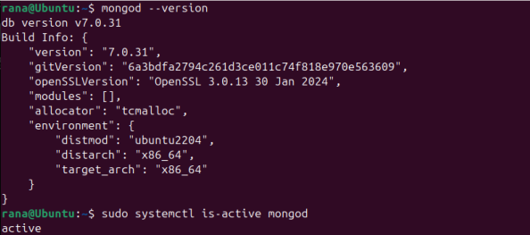
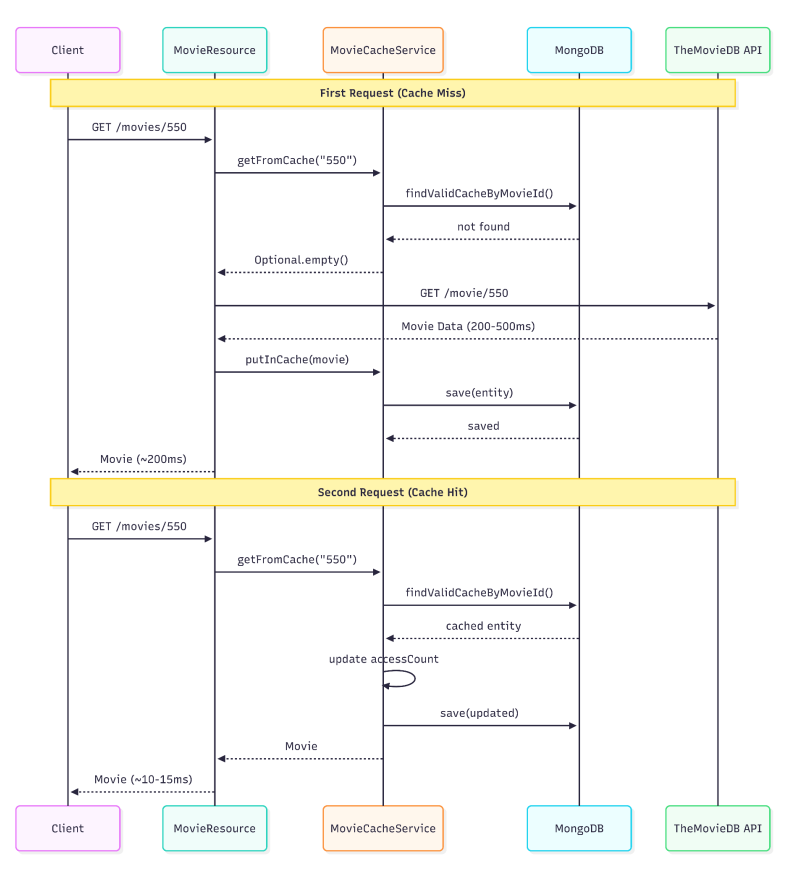
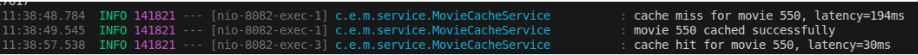
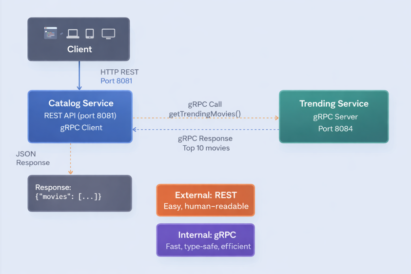
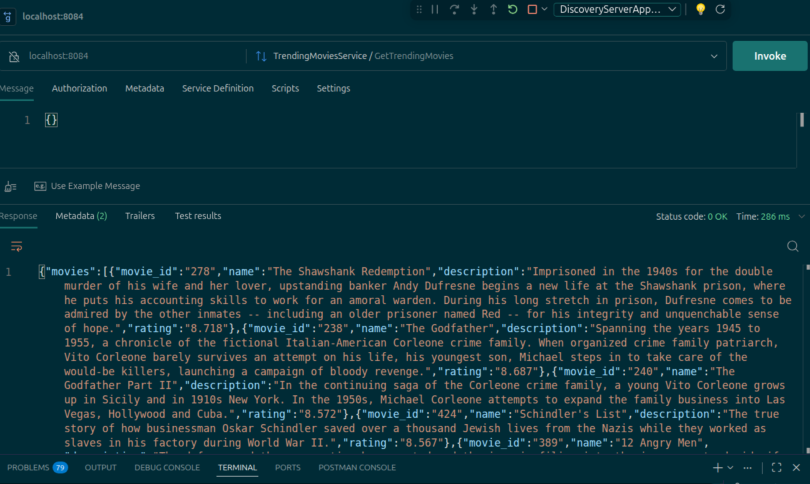
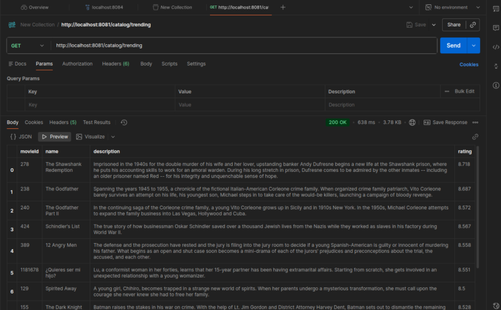
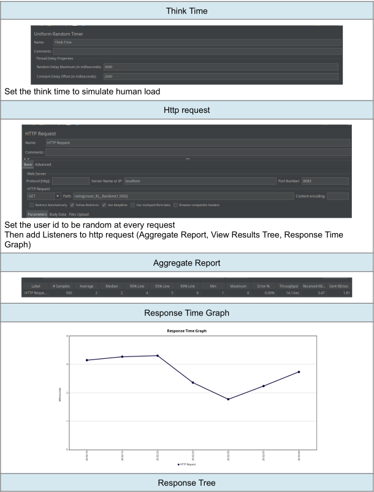

# Lab 2: Microservices & Performance Testing

| Name | ID |
|------|----|
| Nouran Ashraf | 21011492 |
| Omnia Tarek Ibrahim | 21010298 |
| Rawan Mohamed Said | 21010547 |
| Rana Mohamed | 21010528 |

---

## Table of Contents

- [A) Change Ratings Service Storage Data Model to MySQL](#a-change-ratings-service-storage-data-model-to-mysql)
- [B) Cache the MovieDB Query Results in MongoDB](#b-cache-the-moviedb-query-results-in-mongodb)
- [C) Create a new Trending Movies Service with gRPC API](#c-create-a-new-trending-movies-service-with-grpc-api)
- [D) Run JMeter Tests](#d-run-jmeter-tests)
- [References](#references)

---

## A) Change Ratings Service Storage Data Model to MySQL

### Introduction

The ratings data service didn't have any database to fetch the ratings for each user from. Instead it had a fixed response for whatever the user is.

### Goal

Implement a MySQL database to store the ratings in and use it to fetch the ratings for each user.

### Installation Steps

Install MySQL:

```bash
sudo apt update
sudo apt install mysql-server
```

Setup MySQL:

```bash
sudo systemctl start mysql

# To setup the root password
sudo mysql

# Then inside MySQL
ALTER USER 'root'@'localhost' IDENTIFIED WITH mysql_native_password BY 'root';
FLUSH PRIVILEGES;
EXIT;
```

Create the ratings database:

```bash
mysql -u root -proot -e "CREATE DATABASE IF NOT EXISTS ratings_db;"
```

### Verification

```bash
sudo systemctl status mysql
```

### Schema Design

The schema was implemented via JPA/Hibernate annotations in the `Rating` entity class, using a composite primary key on `(user_id, movie_id)` to enforce the business rule that each user can rate a movie only once. The physical schema below reflects what Hibernate auto-generates at runtime.

```sql
CREATE DATABASE ratings_db;
USE ratings_db;

CREATE TABLE ratings (
    user_id   VARCHAR(255) NOT NULL,
    movie_id  VARCHAR(255) NOT NULL,
    rating    INT NOT NULL CHECK (rating BETWEEN 1 AND 5),
    PRIMARY KEY (user_id, movie_id)
);
```

### Running Steps

Make sure you have Java 11 or higher:

```bash
java -version
```

If not, install Java 11 and set `JAVA_HOME`:

```bash
sudo apt update
sudo apt install openjdk-11-jdk

# After running the following command, select java 11 as default
sudo update-alternatives --config java

export JAVA_HOME=/usr/lib/jvm/java-11-openjdk-amd64
export PATH=$JAVA_HOME/bin:$PATH
```

Run the microservice:

```bash
cd ratings-data-service
./mvnw spring-boot:run
```

### Implementation Details

**`pom.xml` dependencies:**

```xml
<!-- Spring Data JPA -->
<dependency>
    <groupId>org.springframework.boot</groupId>
    <artifactId>spring-boot-starter-data-jpa</artifactId>
</dependency>

<dependency>
    <groupId>org.springframework.boot</groupId>
    <artifactId>spring-boot-starter-validation</artifactId>
</dependency>

<!-- MySQL Connector -->
<dependency>
    <groupId>mysql</groupId>
    <artifactId>mysql-connector-java</artifactId>
    <scope>runtime</scope>
</dependency>
```

**`application.properties` — MySQL database configuration:**

```properties
spring.datasource.url=jdbc:mysql://localhost:3306/ratings_db
spring.datasource.username=root
spring.datasource.password=root
spring.datasource.driver-class-name=com.mysql.cj.jdbc.Driver

spring.jpa.hibernate.ddl-auto=create-drop
spring.jpa.show-sql=true
spring.sql.init.mode=always
spring.jpa.defer-datasource-initialization=true
```

**`Rating.java` entity class:**

```java
@Entity
@Table(name = "ratings")
@IdClass(Rating.RatingId.class)
public class Rating {

    @Id
    @Column(name = "user_id", nullable = false)
    @JsonIgnore
    private String userId;

    @Id
    @Column(name = "movie_id", nullable = false)
    private String movieId;

    @Column(name = "rating", nullable = false)
    @Min(value = 1, message = "Rating must be at least 1")
    @Max(value = 5, message = "Rating must be at most 5")
    private int rating;

    // Composite key class
    public static class RatingId implements Serializable {
        private String userId;
        private String movieId;

        public RatingId() {}

        public RatingId(String userId, String movieId) {
            this.userId = userId;
            this.movieId = movieId;
        }

        // equals and hashCode are REQUIRED for composite keys
        @Override
        public boolean equals(Object o) {
            if (this == o) return true;
            if (!(o instanceof RatingId)) return false;
            RatingId that = (RatingId) o;
            return userId.equals(that.userId) && movieId.equals(that.movieId);
        }

        @Override
        public int hashCode() {
            return 31 * userId.hashCode() + movieId.hashCode();
        }
    }

    public Rating() {}

    public Rating(String userId, String movieId, int rating) {
        this.userId = userId;
        this.movieId = movieId;
        this.rating = rating;
    }

    // Getters and Setters
}
```

**`RatingRepository.java`** — extends `JpaRepository` to provide CRUD operations:

```java
@Repository
public interface RatingRepository extends JpaRepository<Rating, Long> {
    List<Rating> findByUserId(String userId);
}
```

**`RatingsResource.java`** — REST controller:

```java
@RestController
@RequestMapping("/ratings")
public class RatingsResource {

    @Autowired
    private RatingRepository ratingRepository;

    @RequestMapping("/{userId}")
    public UserRating getRatingsOfUser(@PathVariable String userId) {
        List<Rating> ratings = ratingRepository.findByUserId(userId);
        return new UserRating(ratings);
    }
}
```

### Technical Questions and Answers

**1. Why did we recommend a relational DB (MySQL) for this service?**

The Ratings Service stores structured data (user ID, movie ID, rating value) with clear relationships between entities. MySQL suits this well because:
- It supports ACID transactions ensuring a rating is never partially saved or duplicated.
- It supports JOIN operations, letting you easily query "all ratings for a movie" or "all ratings by a user".
- It supports aggregations like `AVG(rating)` or `COUNT(*)`.

**2. When is this choice adequate or inadequate?**

*Adequate when:*
- Read-heavy workloads with indexed queries (e.g., `WHERE movie_id = ?`).
- Aggregation queries like computing average ratings, counts, or sorting by score.
- Data consistency requirements — ensuring a user can't rate the same movie twice using constraints and transactions.
- Moderate scale — for a typical movie rating app with millions (not billions) of records, MySQL performs well.

*Inadequate when:*
- Extremely high write throughput — when millions of users are submitting ratings simultaneously, MySQL can become a bottleneck due to row locking and write contention.
- Horizontal scaling needs — MySQL doesn't scale out horizontally like NoSQL options (e.g., Cassandra).
- Very low latency requirements at massive scale — a key-value store (like Redis or DynamoDB) would serve individual rating lookups with lower latency.

---

## B) Cache the MovieDB Query Results in MongoDB

### Introduction

The movie info service calls TheMovieDB API for every movie request, resulting in high latency and repeated identical requests wasting resources.

### Goal

Implement a MongoDB cache that stores movie data after the first API call and serves subsequent requests from the cache.

### Installation Steps

```bash
# Import MongoDB GPG key
wget -qO - https://www.mongodb.org/static/pgp/server-7.0.asc | sudo gpg \
  --dearmor -o /usr/share/keyrings/mongodb-server-7.0.gpg

# Add MongoDB repository
echo "deb [ arch=amd64,arm64 signed-by=/usr/share/keyrings/mongodb-server-7.0.gpg ] \
  https://repo.mongodb.org/apt/ubuntu jammy/mongodb-org/7.0 multiverse" | \
  sudo tee /etc/apt/sources.list.d/mongodb-org-7.0.list

# Install MongoDB
sudo apt-get update
sudo apt-get install -y mongodb-org

# Start and enable service
sudo systemctl start mongod
sudo systemctl enable mongod
```

### Verification



### Schema Design

```json
{
  "_id": ObjectId(""),
  "movieId": "550",
  "name": "Fight Club",
  "description": "A ticking-time-bomb insomniac ..",
  "cachedAt": ISODate("2024-04-05T10:00:00Z"),
  "ttl": ISODate("2024-04-06T10:00:00Z"),
  "accessCount": 47,
  "lastAccessed": ISODate("2024-04-05T15:30:00Z")
}
```

**MongoDB Collection Setup:**

```javascript
// Connect to mongodb
mongosh

// Create database
use movie_info_db

// Create collection
db.createCollection("movie_cache")

// Create unique index on movieId
db.movie_cache.createIndex({ "movieId": 1 }, { unique: true })

// Create TTL index (expires after 24 hours)
db.movie_cache.createIndex({ "ttl": 1 }, { expireAfterSeconds: 0 })
```

### Cache Flow Sequence



### Cache Policy

| Property | Value |
|----------|-------|
| Time to Live | 24 hours |
| Cache Limit | 10,000 entries |
| Eviction Strategy | Least Recently Used (LRU) |

### Implementation Details

**1. Dependencies — `pom.xml`:**

```xml
<!-- MongoDB dependency -->
<dependency>
    <groupId>org.springframework.boot</groupId>
    <artifactId>spring-boot-starter-data-mongodb</artifactId>
</dependency>
```

**2. Configuration — `application.properties`:**

```properties
# MongoDB configs
spring.data.mongodb.host=localhost
spring.data.mongodb.port=27017
spring.data.mongodb.database=movie_info_db

# Cache configs
movie.cache.enabled=true
movie.cache.max-size=10000
```

**3. Added Modules:**

| Class | Responsibility |
|-------|----------------|
| `MovieCacheEntity` | Map Java objects to MongoDB documents |
| `MovieCacheRepository` | Database operations |
| `MovieCacheService` | Caching logic with TTL and LRU eviction |
| `MovieResource` | HTTP handling (edited to enable cache first) |

### Cache Miss vs Cache Hit Time



### Technical Questions & Answers

**1. Why did we suggest caching in this service, not other services?**

Caching is recommended for the Movie Info Service because it calls an external API with high latency. The movie data rarely changes, making it ideal for caching. The Ratings Service is not cached because ratings change frequently and users expect real-time updates. Caching is effective for read-heavy, write-rare scenarios where some staleness is acceptable.

**2. Where does caching always matter?**

Cache when data is expensive to get, cheap to store, and doesn't change often.

**3. When not to cache?**

Don't cache when real-time accuracy is critical and writes dominate reads.

---

## C) Create a new Trending Movies Service with gRPC API

### Service Communication Architecture Diagram



The architecture uses two communication protocols:
- **External: REST** — Easy, human-readable (port 8081)
- **Internal: gRPC** — Fast, type-safe, efficient (port 8084)

### Implementation Overview

#### Step 1: Protocol Buffer Template

```protobuf
syntax = "proto3";

package trendingmoviesservice;

option java_multiple_files = true;
option java_outer_classname = "TrendingMoviesProto";
option java_package = "com.example.grpc";

service TrendingMoviesService {
  rpc GetTrendingMovies(GetTrendingMoviesRequest) returns (GetTrendingMoviesResponse);
}

message Movie {
  string movie_id = 1;
  string name = 2;
  string description = 3;
  string rating = 4;
}

message GetTrendingMoviesResponse {
  repeated Movie movies = 1;
}

message GetTrendingMoviesRequest {}
```

#### Step 2: gRPC Server Creation

The `TrendingMoviesService` gRPC server fetches data from TMDB using `RestTemplate`:

```java
@Override
public void getTrendingMovies(GetTrendingMoviesRequest request,
        StreamObserver<GetTrendingMoviesResponse> responseObserver) {
    String url = "https://api.themoviedb.org/3/movie/top_rated?api_key=" + apiKey;
    TmdbTopMoviesResponse tmdbResponse = restTemplate.getForObject(url, TmdbTopMoviesResponse.class);

    GetTrendingMoviesResponse.Builder responsBuilder = GetTrendingMoviesResponse.newBuilder();
    tmdbResponse.getResults()
            .stream()
            .limit(topKMovies)
            .forEach(m -> responsBuilder.addMovies(
                    Movie.newBuilder()
                            .setMovieId(m.getId())
                            .setName(m.getTitle())
                            .setDescription(m.getOverview())
                            .setRating(m.getVote_average())
                            .build()));

    responseObserver.onNext(responsBuilder.build());
    responseObserver.onCompleted();
}
```

#### Step 3: Client Dependencies

gRPC client in the `movie-catalog-service`:

```java
@Service
public class TrendingMoviesClientService {

    private final TrendingMoviesServiceGrpc.TrendingMoviesServiceBlockingStub trendingMoviesServiceBlockingStub;

    public TrendingMoviesClientService(TrendingMoviesServiceGrpc.TrendingMoviesServiceBlockingStub trendingMoviesServiceBlockingStub) {
        this.trendingMoviesServiceBlockingStub = trendingMoviesServiceBlockingStub;
    }

    public GetTrendingMoviesResponse getTrendingMovies(GetTrendingMoviesRequest request) {
        return trendingMoviesServiceBlockingStub.getTrendingMovies(request);
    }
}
```

#### Architecture Flow

The Catalog Service calls the TrendingMoviesService using gRPC, then exposes a REST API for user access:

```java
/**
 * Makes a call to TrendingMoviesService to get top 10 trending movies by rating
 * @return List<Movie> that contains name, description and rating
 */
// http://127.0.0.1:8081/catalog/trending
@RequestMapping("/trending")
public List<Movie> getTrendingMovies() {
    GetTrendingMoviesResponse response = trendingMoviesClientServiceStub.getTrendingMovies(
            GetTrendingMoviesRequest.newBuilder().build());
    return response.getMoviesList().stream()
            .map(m -> new Movie(m.getMovieId(), m.getName(), m.getDescription(), m.getRating()))
            .toList();
}
```

### Technical Questions & Answers

**Q1: From which data source does this service fetch its data?**

The service fetches data from:
```
https://api.themoviedb.org/3/movie/top_rated?api_key=[apiKey]
```

**Q2: Is this data source adequate for this service use case?**

Yes. It fetches movies by rating and we extract the top 10 rated movies from the results.

**Q3: Is there a method to improve the performance of this service?**

Yes:
- Implement **caching** — the list doesn't get updated frequently (like daily or weekly), significantly reducing API calls and improving response times.
- Use **non-blocking gRPC calls** to avoid delays when the system is slow.

### API Testing Guide

**gRPC API Testing (Using Postman):**

1. Open Postman
2. Choose New → gRPC
3. Enter API endpoint: `localhost:8084`
4. Import the proto file from: `/trending/src/main/proto`
5. Leave message as empty JSON
6. Click **Invoke**



**REST API Endpoint:**
```
GET http://localhost:8081/catalog/trending
```

---

## D) Run JMeter Tests

### 1. MySQL

#### Performance Test

##### Low Load

**Thread Properties:** 100 threads, 20s ramp-up, 5 loops = **500 total requests**

- **Ramp up period** — the time to start the full number of threads. 20 seconds means each 200ms a new thread will start.
- **Loop count** — the number of times each thread loops over all requests. Here each thread does 5 requests for 500 total.

**Aggregate Report:**

| Label | # Samples | Average | Median | 90% Line | 95% Line | 99% Line | Min | Max | Error % | Throughput |
|-------|-----------|---------|--------|----------|----------|----------|-----|-----|---------|------------|
| HTTP Request | 500 | 2 | 2 | 4 | 5 | 6 | 1 | 6 | 0.00% | 14.1/sec |

**Response Time Graph & Results Tree:**



##### High Load

**Thread Properties:** 1000 threads, 15 loops = **15,000 total requests**

**Aggregate Report:**

| Label | # Samples | Average | Median | 90% Line | 95% Line | 99% Line | Min | Max | Error % | Throughput |
|-------|-----------|---------|--------|----------|----------|----------|-----|-----|---------|------------|
| HTTP Request | 15000 | 1 | 1 | 3 | 4 | 5 | 0 | 19 | 0.00% | 175.8/sec |


#### Stress Test

Goal: identify the breaking point by increasing the number of users and requests.

| Requests | Average | Median | 90% Line | 95% Line | 99% Line | Max | Error % | Throughput |
|----------|---------|--------|----------|----------|----------|-----|---------|------------|
| 150,000 | 1 | 1 | 2 | 2 | 5 | 55 | 0.00% | 1035.1/sec |
| 160,000 | 1 | 1 | 2 | 2 | 6 | 70 | 0.00% | 1448.3/sec |
| **200,000 (Breaking Point)** | **459** | **1** | **3** | **5** | **606** | **68577** | **0.00%** | **1121.6/sec** |
| 240,000 | 778 | 1 | 2 | 5 | 37373 | 134431 | 0.00% | 1008.3/sec |


At **240,000 requests** (12,000 threads × 20 loops) — only 5 requests fail (≈0.002% error rate), but 1% of users experience response times exceeding 37 seconds.

**Maximum requests the server fulfills without failure = 200,000.**


---

### 2. MongoDB

#### Test Data Generation

To ensure realistic testing and avoid 404 errors, 500 valid movie IDs were extracted from TheMovieDB API:

```bash
cd ~/jmeter-tests
echo "movieId" > movie_ids.csv
for page in {1..25}; do
    curl -s "https://api.themoviedb.org/3/movie/popular?api_key=<YOUR_API_KEY>&page=$page" | \
    grep -o '"id":[0-9]*' | cut -d: -f2 >> movie_ids.csv
done
```

#### Without Cache

##### Performance Test — Low Load

**Thread Properties:** 100 threads, 30s ramp-up, 2 loops = **200 total requests**

**Aggregate Report:**

| Label | # Samples | Average | Median | 90% Line | 95% Line | 99% Line | Min | Max | Error % | Throughput |
|-------|-----------|---------|--------|----------|----------|----------|-----|-----|---------|------------|
| HTTP Request | 200 | 59 | 53 | 77 | 98 | 157 | 42 | 211 | 0.00% | 5.7/sec |
| TOTAL | 200 | 59 | 53 | 77 | 98 | 157 | 42 | 211 | 0.00% | 5.7/sec |


##### Performance Test — High Load

**Thread Properties:** 500 threads, 30s ramp-up, 50 loops = **25,000 total requests**

**Aggregate Report:**

| Label | # Samples | Average | Min | Max | Std. Dev. | Error % | Throughput |
|-------|-----------|---------|-----|-----|-----------|---------|------------|
| HTTP Request | 25000 | 108 | 41 | 1317 | 109.73 | 0.00% | 113.7/sec |


##### Stress Test (Without Cache)

| Requests | Average | Median | 90% Line | 95% Line | 99% Line | Min | Max | Error % | Throughput |
|----------|---------|--------|----------|----------|----------|-----|-----|---------|------------|
| 100,000 | 1290 | 207 | 3128 | 9403 | 15481 | 40 | 25452 | 0.00% | 191.6/sec |
| 200,000 | 444 | 112 | 552 | 1255 | 6107 | 39 | 36342 | 0.00% | 236.4/sec |
| **500,000 (max without failure)** | **189** | **93** | **423** | **617** | **1253** | **38** | **3335** | **0.00%** | **259.5/sec** |

**550,000 (Break Point):**

| # Samples | Average | Median | 90% | 95% | 99% | Min | Max | Error % | Throughput |
|-----------|---------|--------|-----|-----|-----|-----|-----|---------|------------|
| 550000 | 3323 | 798 | 3976 | 7837 | 56364 | 39 | 268967 | 0.03% | 280.0/sec |


**Break Point Analysis:**
- **Before Breakpoint:** Moderate and stable response times with small fluctuations.
- **BreakPoint (~02:53):** Sharp spike reaching ≈175,000ms — system becomes overloaded.
- **Under Stress:** Response times remain high then gradually decrease with fluctuations.
- **Recovery:** Towards the end, response times drop significantly, likely due to reduced load.

#### With Cache

> After each test, clear the cache before the next run:
> ```javascript
> mongosh
> use movie_info_db
> db.movie_cache.deleteMany({})
> ```

##### Performance Test — Low Load

**Thread Properties:** 100 threads, 30s ramp-up, 2 loops = **200 total requests**

**Aggregate Report:**

| # Samples | Average | Median | 90% Line | 95% Line | 99% Line | Min | Max | Error % | Throughput |
|-----------|---------|--------|----------|----------|----------|-----|-----|---------|------------|
| 200 | 69 | 60 | 94 | 168 | 210 | 5 | 350 | 0.00% | 5.8/sec |

##### Performance Test — High Load

**Thread Properties:** 500 threads, 30s ramp-up, 50 loops = **25,000 total requests**

**Aggregate Report:**

| # Samples | Average | Median | 90% Line | 95% Line | 99% Line | Min | Max | Error % | Throughput |
|-----------|---------|--------|----------|----------|----------|-----|-----|---------|------------|
| 25000 | 27 | 15 | 59 | 89 | 195 | 3 | 657 | 0.00% | 116.6/sec |


> **Note:** Cache benefits start to show with the 25,000 requests, yielding better results than without the cache.

##### Stress Test (With Cache)

| Concurrent Users | Loops | Ramp | # Samples | Average | Error % | Throughput |
|-----------------|-------|------|-----------|---------|---------|------------|
| 1000 | 100 | 30 | 100,000 | 337 ms | 0.00% | 231.2/sec |
| 2000 | 100 | 60 | 200,000 | 3495 ms | 0.00% | 254.5/sec |
| 2000 | 250 | 50 | 500,000 | 3133 ms | 0.00% | 284.7/sec |
| 3000 | 250 | 55 | 107,574 | 2975 ms | 0.00% | 351.8/sec |


#### Comparison

##### Load Testing — 200 Users

| Metric | No Cache | Cached |
|--------|----------|--------|
| Average Latency | 59 ms | 69 ms |
| P90 | 77 ms | 94 ms |
| P95 | 98 ms | 168 ms |
| P99 | 157 ms | 210 ms |
| Throughput | 5.7/sec | 5.8/sec |
| Error Rate | 0% | 0% |

> In the low load test with 200 requests, almost every requested movie was unique. This meant the cache never had the data (cache miss), so each request had to check the cache (4–8ms overhead) and then call the API. As a result, the cached version was actually slightly slower than having no cache at all.

##### Stress Testing Comparison

| Concurrent Users | Loops | Ramp | No Cache Avg | No Cache Error | With Cache Avg | With Cache Error |
|-----------------|-------|------|--------------|----------------|----------------|-----------------|
| 1000 | 100 | 30 | 1290 ms | 0% | 337 ms | 0% |
| 2000 | 100 | 60 | 444 ms | 0% | 3495 ms | 0% |
| 2000 | 250 | 50 | 189 ms | 0% | 3133 ms | 0% |
| 2200 | 250 | 55 | 3323 ms | 0.03% | 2360 ms (10 min) | 0% |


---

### 3. gRPC

#### Performance Test — Low Load

**Thread Properties:** 100 threads, 20s ramp-up, 2 loops = **200 total requests**

HTTP Request: `GET /catalog/trending` on `localhost:8081`

**Aggregate Report:**

| Label | # Samples | Average | Median | 90% Line | 95% Line | 99% Line | Min | Max | Error % | Throughput |
|-------|-----------|---------|--------|----------|----------|----------|-----|-----|---------|------------|
| HTTP Request | 200 | 147 | 118 | 200 | 330 | 513 | 77 | 602 | 0.00% | 8.0/sec |


#### Performance Test — High Load

**Thread Properties:** 1000 threads, 20s ramp-up, 5 loops = **5,000 total requests**

**Aggregate Report:**

| Label | # Samples | Average | Median | 90% Line | 95% Line | 99% Line | Min | Max | Error % | Throughput |
|-------|-----------|---------|--------|----------|----------|----------|-----|-----|---------|------------|
| HTTP Request | 5000 | 1728 | 1291 | 2713 | 4510 | 57832 | 79 | 52666 | 0.00% | 67.5/sec |


#### Stress Test

| Requests | Average | Median | 90% Line | 95% Line | 99% Line | Min | Max | Error % | Throughput |
|----------|---------|--------|----------|----------|----------|-----|-----|---------|------------|
| 10,000 | 8225 | 8201 | 14134 | 14740 | 18266 | 77 | 64433 | 0.00% | 97.5/sec |
| **15,000 (Breaking Point)** | **27082** | **29048** | **40953** | **41230** | **46006** | **77** | **140669** | **0.00%** | **90.1/sec** |
| 16,500 | 22836 | 24361 | 34286 | 34700 | 35089 | 78 | 216417 | 0.01% | 65.5/sec |


At 16,500 requests, errors appear with `500 Internal Server Error` on `/catalog/trending`.

**gRPC service maximum requests without failure = 15,000.**

---

## References

- gRPC & Microservices Tutorial: [YouTube Playlist](https://youtube.com/playlist?list=PLVz2XdJiJQxw0f6wXQCdWKabLdqSzGA0X)
- TMDB API Documentation — Top Rated Movies: [developer.themoviedb.org](https://developer.themoviedb.org/reference/movie-top-rated-list)
